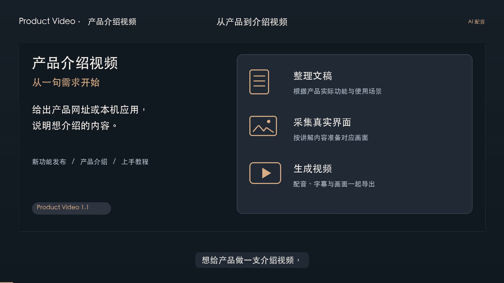

# Product Video

给产品做介绍视频的 Skill。把产品网址或应用名称交给 Agent，告诉它要讲什么，就可以开始准备文稿、采集界面、生成配音和字幕，最后导出视频。

适合介绍自己的应用、演示新功能、制作上手教程。已有文稿和截图也能接着用。

[](https://github.com/Lincb522/product-video/raw/refs/heads/main/docs/assets/product-video-intro.mp4)

[观看或下载介绍视频 · 1 分 34 秒](https://github.com/Lincb522/product-video/raw/refs/heads/main/docs/assets/product-video-intro.mp4)

## 可以做什么

### 自动准备界面素材

网页在独立的后台浏览器里打开，按讲解内容切换页面、搜索、滚动和截图，不占用你正在使用的浏览器。遇到需要登录的页面，会先打开登录准备窗口，完成后再回到后台采集。

macOS 应用可以按指定窗口采集，也支持通过应用暴露的辅助功能控件进行后台操作。需要系统允许辅助功能与屏幕录制；最小化窗口、未暴露控件或必须前台操作的应用，可能需要你先调整好状态。

### 写文稿、选声音

可以让 Agent 根据产品实际功能整理介绍，也可以直接提供已经写好的稿子。告诉它视频给谁看、重点讲哪几件事，文稿会更贴近这次用途。

配音使用火山引擎豆包语音，默认小何 2.0。内置音色目录支持按角色名称和语言查找，可以先试听一小段，再决定声音、语速和音量。[查看角色目录](scripts/engine/examples/voices.csv)。目录中的角色是否可调用，取决于你的语音服务账号权限。

### 操作演示、对照与字幕

可以展示鼠标移动和点击，再切换到实际操作后的截图；也可以把两张画面并排，展示不同主题或操作前后的变化。画面之间支持淡入淡出，转场时长可以调整。

中文和英文旁白可以自动对齐字幕。其他语言可以提供字幕时间轴，也可以选择不加字幕。成片中的鼠标是模拟操作动画，会标注“操作演示”。

### 产品更新后继续修改

只换界面或调整转场，可以沿用原配音。修改某一章文稿，只重新生成这一章；已经完成的章节保留，不必从头制作。

视频、字幕、配音、文稿和项目配置都会保存在本地，方便继续修改。

## 安装

目前验证过的运行环境是 macOS，需要 **Python 3.11+、FFmpeg（含 ffprobe）**。macOS 应用自动采集还需要 Command Line Tools 和系统权限。Windows 未验证；Linux 的完整制作流程也未验证。

### 安装到 Codex

在终端运行：

```sh
git clone https://github.com/Lincb522/product-video.git "${CODEX_HOME:-$HOME/.codex}/skills/product-video"
sh "${CODEX_HOME:-$HOME/.codex}/skills/product-video/scripts/setup.sh"
```

安装脚本会在 Skill 自己的目录中准备 Python 依赖和专用 Chromium。它不会安装系统 Python、FFmpeg，也不会开通语音服务。

如果已经有同名 Skill，先确认原目录的内容，不要直接覆盖。安装完成后，在 Codex 新开一段对话，使用 `$product-video`。

### 第一次做视频

直接发送类似这样的需求，把网址换成你的产品：

```text
使用 $product-video，给 https://example.com 做一支一分钟的介绍视频。
给第一次接触这个产品的用户看，重点介绍搜索和收藏。
自动采集最新界面，后台截图，用深色主题。
配音用小何 2.0，带中文字幕和点击演示。
先给我看文稿，确认后再生成。
```

介绍本机应用时，把网址换成应用名称，并说明要展示哪些页面。Agent 会整理文稿和采集计划，你不用手写 JSON。

首次使用会出现配音设置页。完成 Key 配置后，任务继续；后面使用会直接读取已有配置。

## 配音 Key 怎么获取

**火山引擎提供免费试用额度，可以先试配音。** 默认小何 2.0 使用的豆包语音合成模型 2.0，目前有 **20,000 字符免费额度，有效期半年**。需要在控制台点击“试用”领取；额度用尽、到期或转为正式服务后，试用额度失效。具体额度、适用范围和有效期以领取页面为准，详见[官方试用额度说明](https://docs.volcengine.com/docs/6561/1359369?lang=zh)（2026 年 9 月核对）。

1. 打开[豆包语音控制台](https://console.volcengine.com/speech/new/overview)，登录火山引擎账号，按官网要求完成账号认证。
2. 在所选项目中进入需要的语音合成服务。首次使用可先点击“试用”，已有可用服务则直接继续；默认小何 2.0 对应语音合成 2.0。
3. 找到同一项目的 API Key 管理，创建或选择可用的 Key，复制后回到 Product Video 的本机设置页。
4. 粘贴并点击“保存并继续”。不用把 Key 发给 Agent，也不用自己编辑配置文件。

使用的是**豆包语音 API Key**，不是火山方舟 Key 或账号通用的 Access Key。控制台入口可能调整，可参考[官方配置说明](https://www.volcengine.com/docs/6561/1167802?lang=zh)。

Key 保存在当前用户的 `~/.config/product-video/credentials.json`，文件权限为 `0600`，不会随视频项目一起导出。配音会把旁白文本和音色参数发送给火山引擎，按语音服务账号的授权和用量执行；本地视频引擎不向语音服务上传截图。

登录、验证码、实名认证、服务开通和付款，需要你在提示时完成。更换 Key、远程机器配置等操作见[首次配置说明](references/first-run.md)。

## 可以这样继续修改

**只改文稿**

```text
开头太像产品说明书了，改得自然一点。
先别生成配音，把修改后的文稿给我看。
```

**先换个声音听听**

```text
用 Vivi 2.0 读第一段，先给我听一个短样，别重做整支视频。
```

**展示新版本界面**

```text
重新采集当前版本的界面，保持原文稿和配音，只更新画面。
```

**演示一次操作**

```text
这一段展示从列表打开详情的过程。
保留操作前后的实际截图，加上鼠标移动和点击提示。
```

## 拿到哪些文件

默认生成 **16:9、1080p、30 fps** 视频，使用 H.264 / AAC 编码。当前仅支持 16:9 横屏，不支持竖版输出。

| 文件 | 用途 |
| --- | --- |
| `product-introduction.mp4` | 含配音和字幕的视频 |
| `subtitles.srt` | 单独的字幕文件，可导入剪辑软件 |
| `narration.wav` | 完整旁白音轨 |
| `narration.txt` | 旁白原稿 |
| `preview/` | 各步骤的预览图 |
| `project.resolved.json`、`timeline.json` | 实际使用的配置和时间轴 |

`output/latest.json` 会指向最新生成并完成解码校验的成片。旧成片保留在对应的版本目录中。

## 常见问题

**需要先自己找截图吗？**

不需要。提供网址或应用名称后，由 Agent 观察实际界面并准备采集计划。你已有合适的截图，也可以直接提供。

**采集时会抢鼠标吗？**

默认网页采集在后台浏览器里进行；macOS 路径按指定窗口操作，不移动系统鼠标。网页登录、系统授权是单独的准备步骤。应用无法后台操作时会停下来说明原因。

**生成视频需要付费吗？**

本项目按 MIT 许可证开源。配音使用你自己的火山引擎账号，**可先领取免费试用额度**；额度和领取方式见上方配置说明。试用结束后，如需继续配音，再按官网价格开通正式服务。使用 Agent 本身遵循对应平台的计费规则。更换文稿或声音会生成新配音，只改画面会复用已有配音。

**语音生成到一半失败怎么办？**

已经成功的章节会保留。处理网络、音色权限或额度问题后，可以继续同一个项目。失败后不会自动反复调用计费接口，也不会替你换成其他声音。

**成片可以直接发布吗？**

导出的 MP4 可以直接播放和上传。发布前请看一遍画面和字幕、听一遍配音，确认没有私人数据，也确认截图、Logo 和其他素材可以公开使用。自动解码检查不能代替内容检查。

## 详细说明

- [Skill 使用规则](SKILL.md)
- [自动采集与登录准备](references/capture.md)
- [首次配置与 Key 获取](references/first-run.md)
- [文稿写法](references/narration.md)
- [命令行、项目配置和故障处理](scripts/engine/README.md)

如果遇到问题，可以[提交 Issue](https://github.com/Lincb522/product-video/issues)，说明系统、制作步骤和错误信息。请删去 Key、私人地址及敏感截图。

## 许可证

[MIT](LICENSE)。语音服务、音色授权和费用由对应服务提供方管理。本仓库不分发语音模型、声音样本库或服务凭据；官方音色目录来源见 [NOTICE](NOTICE)。
