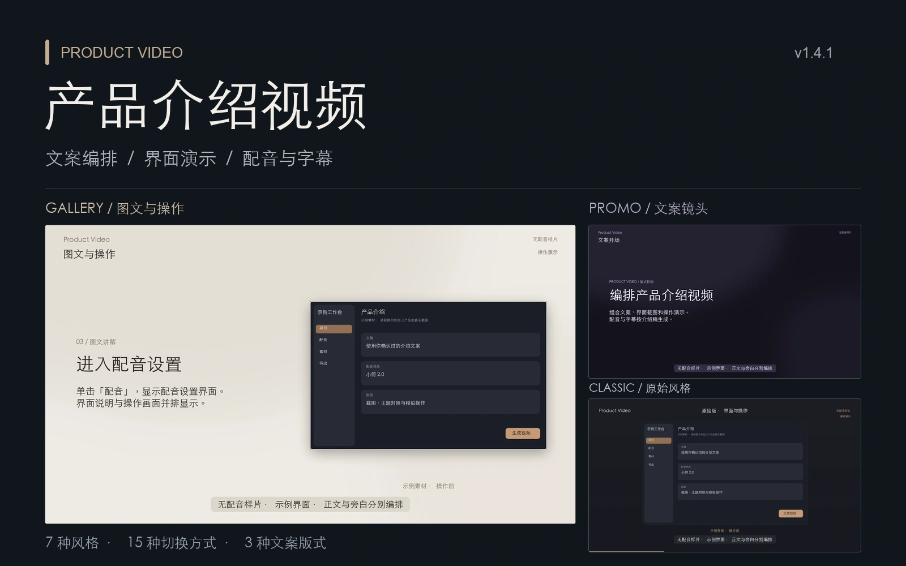
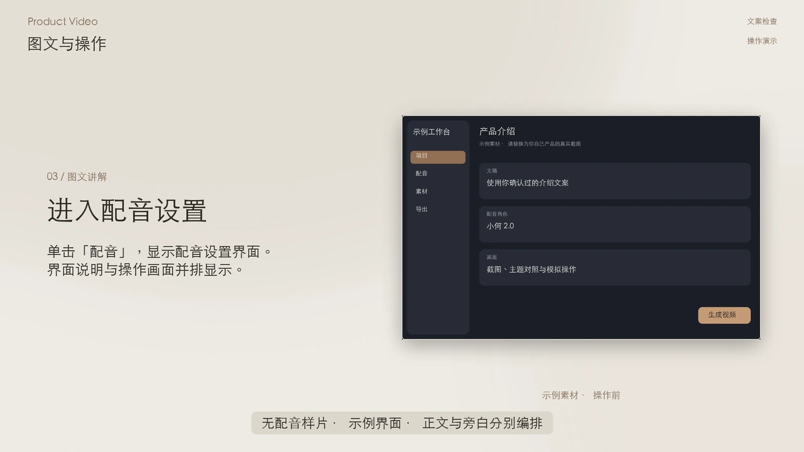

<p align="center">
  
</p>

<h1 align="center">Product Video</h1>

<p align="center">在 Codex 中编排文案、采集实际界面，生成带配音和字幕的产品介绍视频。</p>

<p align="center">
  <a href="scripts/engine/pyproject.toml"></a>
  <a href="#安装"></a>
  <a href="LICENSE"></a>
</p>

<p align="center">
  <a href="#预览">预览</a> ·
  <a href="#七种风格">七种风格</a> ·
  <a href="#文案与旁白">文案与旁白</a> ·
  <a href="#安装">安装</a> ·
  <a href="#开始制作">开始制作</a> ·
  <a href="#文档">文档</a>
</p>

适合应用介绍、功能更新和上手教程。提供产品网址或 macOS 应用名称，说明受众和重点；已有文稿、截图和配音项目也可以继续使用。

**原始版本已包含在当前版本中。** 选择 `classic` 即可使用原来的视觉布局、配色、字幕位置、进度条和默认淡入淡出。六种增强风格与原始风格均支持文案镜头、截图和操作演示。

## 预览

[](https://github.com/Lincb522/product-video/raw/refs/heads/main/docs/assets/story-demo.mp4)

| 样片 | 展示内容 | 观看 |
| --- | --- | --- |
| **图文编排** · 28 秒 | 文案开场、要点列表、图文并排、模拟点击、完整界面与收尾 | [播放 / 下载](https://github.com/Lincb522/product-video/raw/refs/heads/main/docs/assets/story-demo.mp4) |
| **转场与镜头** · 25 秒 | 影院风格、局部聚焦、双图对照及六种增强转场 | [播放 / 下载](https://github.com/Lincb522/product-video/raw/refs/heads/main/docs/assets/motion-demo.mp4) |
| **原始介绍视频** · 1 分 34 秒 | 最初版本的介绍视频，保留原有内容与配音 | [播放 / 下载](https://github.com/Lincb522/product-video/raw/refs/heads/main/docs/assets/product-video-intro.mp4) |

前两支为引擎实际渲染的**无配音验收样片**，使用明确标注的示例界面。图文样片采用当前文案规范；原始介绍视频保留历史版本，不代表新版文案。正式制作会使用目标产品的实际素材和已确认的旁白。

## 七种风格

风格控制画面配色、默认镜头、转场和操作节奏，内容版式独立选择。下图均来自当前引擎；静态图展示配色与版式，动态效果见上方样片。

<table>
  <tr>
    <td width="50%"><br><strong>Classic · 原始版</strong><br>保留初版视觉与淡入淡出，继续使用修正后的操作时序。</td>
    <td width="50%"><br><strong>Product · 产品演示</strong><br>默认风格。深色画面、轻微推进，适合功能介绍与更新。</td>
  </tr>
  <tr>
    <td><br><strong>Promo · 节奏宣传</strong><br>缩放与水平推移，停留较短，适合重点速览。</td>
    <td><br><strong>Tutorial · 教学演示</strong><br>固定镜头、较慢指针和较长停留，便于跟随操作。</td>
  </tr>
  <tr>
    <td><br><strong>Cinema · 影院</strong><br>墨黑与冷灰，景深叠化、层叠推进，适合细节展示。</td>
    <td><br><strong>Gallery · 画廊</strong><br>暖白与棕灰，圆角开幕、固定镜头，适合设计与主题展示。</td>
  </tr>
  <tr>
    <td><br><strong>Minimal · 极简</strong><br>纸白与灰绿，上移遮罩，适合简洁的工具介绍。</td>
    <td><strong>所有风格均支持</strong><br><br>文案开场与章节说明<br>功能要点列表<br>文字与截图左右并排<br>完整截图与双图对照<br>模拟点击、指针拖动和局部聚焦<br><br><a href="references/motion.md">查看风格与转场参数 →</a></td>
  </tr>
</table>

直接告诉 Agent「用原始版」或「改成画廊风格」即可。手动编辑项目时设置 `video.style`：

```json
{
  "video": {
    "style": "classic"
  }
}
```

显式颜色、镜头和转场参数会覆盖预设；切换风格时，移除不再需要的覆盖项。

### 转场与模拟操作

支持 **15 种切换方式**，包含直接切换。章节与单个镜头可分别配置，通常选两三种保持节奏一致。

| 类型 | 效果 |
| --- | --- |
| 基础衔接 | 直接切换、淡入淡出、水平推移、向上推移、柔边擦除、缩放叠化、虚化叠化 |
| 增强转场 | 景深叠化、层叠推进、上移遮罩、圆角开幕、双侧揭幕、玻璃扫光 |

模拟操作遵循 **移动 → 停留 → 按下 / 拖动 → 显示结果 → 留出阅读时间**。网页采集可记录真实控件坐标，放大界面时指针同步变换；操作完成前保持操作前截图，避免结果提前出现。

视频会标注「操作演示」。当前模拟基于静态截图，指针拖动只展示按住、移动和释放，不能还原打字、滚动惯性或拖动中的内容变化；引擎尚不接收真实录屏素材。支持 `reduced_motion`，可关闭推进和复杂转场。

## 文案与旁白

### 画面不只放截图

画面正文、旁白和字幕分别编排。七种风格都支持以下版式，也可以与截图镜头混排；纯文案片无需虚构截图。

| 版式 | 内容 | 适合的位置 |
| --- | --- | --- |
| `title` | 主标题，可加短标签与正文 | 开场、章节说明、必要的收尾 |
| `bullets` | 主标题与 1–4 项要点 | 功能概览、操作条件、关键差异 |
| `split` | 文字与一张等比截图，支持左右互换 | 功能讲解、操作前后说明 |

正文按字体和分辨率测量、换行，保留底部字幕区域。内容仍放不下时要求拆分镜头，不截断或用省略号隐藏正文。只修改画面文字，可以复用未改变的配音。[查看字段与完整示例 →](references/content.md)

### 默认写作与朗读规范

| 范围 | 要求 |
| --- | --- |
| 信息 | 围绕实际功能、操作和结果展开；名称准确，保留必要的专业信息 |
| 句式 | 使用陈述句，禁用反问、设问、自问自答和串场填充 |
| 措辞 | 不用宣传套话、重复解释、夸张承诺；避免过度口语化和名词堆砌 |
| 收尾 | 最后一项实际信息表达完整即可结束，不自动补本地处理、隐私或效率口号 |
| 朗读 | 专业、平稳、清晰，按语义停顿，重音克制；保留用户指定的角色与语气 |

例如：「字幕根据配音时间戳对齐」「修改画面时可复用原有配音」。画面文字可以提炼，字幕跟随实际旁白。已有确认稿不会在 TTS 或字幕阶段被擅自改写。

写作规范由 Skill 在合成前执行；语气参数仅指导支持该能力的音色朗读。语气提示不能代替文案编辑。[查看完整文案与旁白规范 →](references/narration.md)

## 安装

已验证环境为 **macOS**，需要 **Python 3.11+、FFmpeg（含 ffprobe）**。macOS 应用自动采集还需要 Command Line Tools、辅助功能与屏幕录制权限。Windows 和 Linux 的完整制作流程尚未验证。

在终端执行：

```sh
git clone https://github.com/Lincb522/product-video.git "${CODEX_HOME:-$HOME/.codex}/skills/product-video"
sh "${CODEX_HOME:-$HOME/.codex}/skills/product-video/scripts/setup.sh"
```

安装脚本准备 Skill 专用 Python 环境、依赖和 Chromium。系统 Python、FFmpeg 和语音服务需另行准备。如果已有同名 Skill，先确认目录内的修改，再决定如何更新。

安装完成后，在 Codex 新开对话，使用 `$product-video`。

## 开始制作

把网址替换为目标产品：

```text
使用 $product-video，为 https://example.com 制作一分钟的产品介绍。
面向首次使用的用户，重点介绍搜索、收藏和导出。
自动采集当前界面，使用 gallery 风格。
安排文案开场、功能要点和图文讲解，关键步骤加点击演示。
配音用小何 2.0，带中文字幕。先给我看文稿，确认后再生成。
```

介绍本机应用时，将网址换成应用名称并说明要展示的页面。Agent 根据真实界面整理文稿和采集计划，无需手写 JSON。

| 阶段 | 处理内容 |
| --- | --- |
| 文稿与编排 | 核对产品事实，整理旁白、画面正文和镜头顺序 |
| 界面采集 | 网页用独立后台浏览器；macOS 按指定窗口和辅助功能控件采集 |
| 配音与字幕 | 分章生成语音；中文、英文根据返回的时间戳对齐字幕 |
| 预览与导出 | 检查转场、指针和结果关键帧，输出并完整解码验证 MP4 |

网页登录使用独立准备窗口，完成后回到后台采集。应用无法后台操作、窗口不可采集或权限不足时，会说明具体原因。其他语言可提供字幕时间轴，或明确关闭字幕。

### 配置配音

配音使用**火山引擎豆包语音**，默认「小何 2.0」。内置音色目录可按角色名称与语言查找，也可先生成短试听；目录列出的角色是否可用，取决于账号授权。

1. 打开[豆包语音控制台](https://console.volcengine.com/speech/new/overview)，按要求完成账号认证，选择项目和语音合成服务。
2. 在同一项目的 API Key 管理中创建或选择可用的 **豆包语音 API Key**。
3. 回到任务自动打开的本机配音设置页，粘贴 Key，点击「保存并继续」。后续任务沿用已有配置。

**可先领取免费试用额度。** 默认小何 2.0 使用的豆包语音合成模型 2.0，目前提供 **20,000 字符、半年有效期**，需在控制台点击「试用」领取。额度用尽、试用到期或转为正式服务后失效；以领取页面为准（2026-09-10 核对）。[官方试用说明](https://docs.volcengine.com/docs/6561/1359369?lang=zh) · [Key 配置说明](https://docs.volcengine.com/docs/6561/1167802?lang=zh)

使用豆包语音 Key，不使用火山方舟 Key 或账号通用 Access Key。Key 通过本机设置页保存到当前用户配置目录，文件权限为 `0600`，无需发送给 Agent。配音会将旁白文本与音色参数发送给火山引擎；引擎不向语音服务上传截图。[首次配置与声音试听 →](references/first-run.md)

### 继续修改

| 需求 | 可以直接这样说 |
| --- | --- |
| 使用原始视觉 | 「切换到 classic，保留原始版布局和默认淡入淡出。」 |
| 修改文案 | 「精简第二章的重复解释，保留功能与限制。先给我看稿，不生成配音。」 |
| 增加图文讲解 | 「这一段左侧放功能说明，右侧展示实际设置界面。」 |
| 试听声音 | 「用 Vivi 2.0 读第一段，先试听，不重做整支视频。」 |
| 更新界面 | 「重新采集当前版本，保持原文稿和配音，只更新画面。」 |
| 调整操作 | 「展示从列表打开详情，保留操作前后截图，点击完成后再显示结果。」 |

相同文稿和配音设置复用已验证音频。只改一章文稿，只重新生成受影响的章节；只改截图、正文、颜色或转场，复用未改变的配音。网络失败后保留已完成章节，不自动反复调用计费接口，也不自动替换音色。

## 输出文件

默认 **16:9 · 1080p · 30 fps · H.264 / AAC**。当前支持横屏输出；正式项目需要旁白，不提供静音或纯音乐制作流程。

| 文件 | 内容 |
| --- | --- |
| `product-introduction.mp4` | 含配音的视频；按项目配置添加字幕 |
| `subtitles.srt` | 独立字幕，可导入剪辑软件 |
| `narration.wav` / `narration.txt` | 完整旁白音轨与原稿 |
| `preview/` | 稳定画面、转场、移动、按下及结果关键帧；索引记录对应时间 |
| `project.resolved.json` / `timeline.json` | 实际配置与时间轴 |

`output/latest.json` 指向最新完成解码校验的成片，旧成片保留在对应版本目录中。解码校验检查文件可播放性；画面、字幕与配音仍需完整审看。

## 当前版本

**v1.4.1** 包含此前全部增强：原始 `classic`、六种增强风格、十五种切换方式、三种正文版式、操作时序与坐标修正，以及统一的文案和旁白规范。旧的截图项目可继续使用；原始视觉通过 `classic` 选择。

当前源码通过 83 项回归测试；原始画面、文案镜头和增强转场已有离线渲染与解码验证。本次维护未调用配音 API，新默认朗读语气未做实际听感验收。测试命令和本地运行方式见[引擎说明](scripts/engine/README.md)。

## 文档

| 文档 | 内容 |
| --- | --- |
| [Skill 使用规则](SKILL.md) | Agent 工作流程与制作要求 |
| [文案与旁白](references/narration.md) | 写作尺度、朗读语气与合成前检查 |
| [文案镜头](references/content.md) | 标题、要点、图文版式及完整示例 |
| [镜头与动效](references/motion.md) | 风格、转场、模拟操作、局部聚焦与离线样片 |
| [自动采集](references/capture.md) | 网页、macOS 窗口、登录准备与坐标记录 |
| [首次配置](references/first-run.md) | Key 配置、音色选择与短试听 |
| [引擎说明](scripts/engine/README.md) | 命令行、项目格式、测试与故障处理 |
| [音色目录](scripts/engine/examples/voices.csv) | 可搜索的公开音色 ID、名称与语言 |

遇到问题可[提交 Issue](https://github.com/Lincb522/product-video/issues)，附系统版本、制作步骤和已脱敏的错误信息。

---

[MIT License](LICENSE) · 语音服务、音色授权与费用由对应提供方管理。官方音色目录来源及第三方说明见 [NOTICE](NOTICE)。
