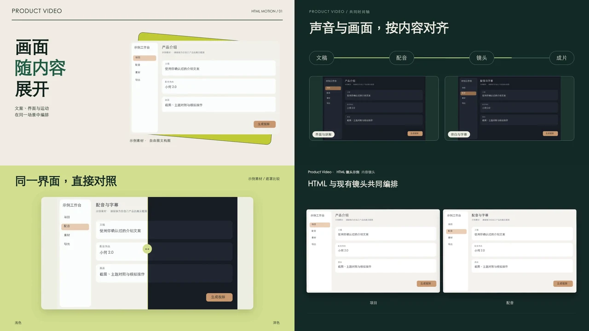
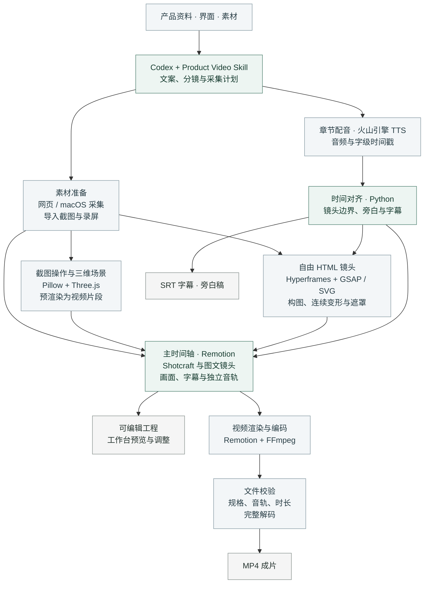

<div align="center">


# Product Video

[效果预览](#效果预览) · [安装](#安装) · [使用](#使用) · [工作原理](#工作原理) · [文档](#文档)

</div>

Product Video 是用于 Codex 的产品视频制作 Skill。提供项目、产品网址或已有素材，并说明介绍对象与制作要求，即可生成带配音和字幕的视频。Skill 负责整理文稿、采集界面、编排镜头，交付 MP4、字幕文件和可编辑工程。

适用于软件产品介绍、功能演示、操作教程和版本发布视频。支持导入已有文稿、截图与录屏，也可从指定网页或 macOS 应用采集界面。

## 功能

图文布局包括功能总览、图文并排、卡片陈列和双图对照。镜头库集成 [video-shotcraft](https://github.com/Vincentwei1021/video-shotcraft)，覆盖界面入场、运镜、转场、文字动画和收尾。截图、录屏与文字可以在同一视频中混排。

画面也可以按内容单独设计。[Hyperframes](https://github.com/heygen-com/hyperframes) 支持连续变形、遮罩对照、流程展开和图文联动，由 Skill 编写动画并绑定素材，用户无需手写 HTML。这些镜头可与现有镜头库混排，时长依据实际旁白确定。连续制作同一产品时，Skill 会检查已有成片或分镜，重新安排切入方式、构图与节奏。

三维场景提供手机、平板、笔记本和屏幕面板等模型，支持材质、灯光与镜头运动。设备屏幕可使用截图或录屏，场景可与二维画面衔接。

旁白按章节合成，字幕与镜头依据实际音频时间对齐。配音角色、语速、背景音乐和音效可以分别设置。修改画面时，文稿及音色参数相同的配音会复用已有缓存。

工作台提供画面预览、镜头排序、时长调整和音轨编辑。生成后可以继续让 Skill 修改文案、布局与镜头，或在工作台调整剪辑。HTML 镜头的内部构图通过源文件修改，主工作台将其显示为视频片段。

## 效果预览

点击预览图可打开对应的 MP4。

[](docs/assets/hyperframes-demo.mp4)

[Hyperframes 与现有镜头混排示例](docs/assets/hyperframes-demo.mp4)

[](docs/assets/editorial-demo.mp4)

[图文排版与界面动效示例](docs/assets/editorial-demo.mp4)

[](docs/assets/studio-demo.mp4)

[三维设备与录屏示例](docs/assets/studio-demo.mp4)

以上样片均使用演示素材，无旁白。

### 视觉风格

| 经典 | 产品 | 宣传 | 教程 |
| --- | --- | --- | --- |
|  |  |  |  |
| 完整界面展示 | 侧栏图文 | 大标题与错位构图 | 步骤导览 |

| 影院 | 画廊 | 极简 |
| --- | --- | --- |
|  |  |  |
| 宽幅构图 | 装裱式陈列 | 平面网格 |

## 安装

运行环境需要 Python 3.11+、Node.js 22+、npm、FFmpeg（含 ffprobe）及中文字体。目前已在 macOS 验证，Windows 与 Linux 尚未完成整体验证。

```sh
git clone https://github.com/Lincb522/product-video.git ~/.codex/skills/product-video
sh ~/.codex/skills/product-video/scripts/setup.sh
```

安装脚本配置 Python 依赖、镜头工作台及浏览器运行环境。也可下载 [已发布版本的安装包](https://github.com/Lincb522/product-video/releases)，将解压后的 `product-video` 目录放入 Codex 的 `skills` 目录，再运行 `scripts/setup.sh`。安装目录已存在时，应先保留其中的自定义修改。

通过 Git 安装的版本可这样更新：

```sh
git -C ~/.codex/skills/product-video pull --ff-only
sh ~/.codex/skills/product-video/scripts/setup.sh
```

压缩包安装的版本需要替换 Skill 文件后重新运行安装脚本。已有 Python 和镜头工作台环境时，也可单独运行 `sh ~/.codex/skills/product-video/scripts/setup-hyperframes.sh` 补装 HTML 镜头环境。Hyperframes 固定为 0.8.40，并附 npm 锁文件。

配音使用火山引擎 TTS，需要可用的账号与额度。首次生成配音时会打开本机配置页，后续自动沿用已保存的设置。音色授权以账号实际开通情况为准。

## 使用

在 Codex 中指定 `$product-video`、介绍对象和制作要求：

```text
使用 $product-video，为当前项目制作一支约 90 秒的中文介绍视频。
面向首次使用该产品的用户，介绍核心功能和一个完整操作流程。
使用当前版本界面，采用产品风格，输出 1080p MP4 和字幕。
```

制作更新视频时，可以要求结合更新内容重新编排：

```text
为这次更新制作宣传视频，先看上一条成片和当前更新内容。
围绕新增功能重新安排讲解顺序，通过操作演示、流程展开和状态对照呈现变化。
使用当前版本的真实界面，保留项目的配音角色。
```

介绍对象可以是当前项目、产品网址或应用。目标观众、时长、风格和配音角色均可指定；已有确认稿或素材时，提供对应文件即可。Skill 会整理分镜、采集计划和视频配置。

修改已有视频时，说明需要调整的段落和内容。例如：

```text
修改第二段的搜索演示，展示筛选条件和结果列表。
保留其他段落与配音，结果画面停留 3 秒。
```

网页采集可录制实际输入、点击和滚动。截图操作演示在操作前后画面之间添加指针移动和点击反馈；需要呈现连续的界面变化时，应使用录屏素材。

## 输出

成片采用 H.264 / AAC 编码，封装为 MP4，并附字幕、旁白稿和可编辑工程。默认规格为 1920×1080、30 fps；当前支持 16:9 画幅和 24–60 fps。

中文、英文字幕根据配音时间戳生成，提供 SRT 文件。其他语言可使用已对齐的字幕，或关闭字幕。工程保留镜头、素材和分章音频。

## 工作原理

Codex 通过 Skill 整理产品资料、文案、分镜和采集计划。Python 引擎读取项目配置，处理素材与配音，并将镜头转换为可编辑的时间轴。



镜头时长取自实际配音，字幕根据字级时间戳对齐；旁白、音效和音乐分别上轨。Shotcraft 与图文镜头由 React / TypeScript 组件绘制。Hyperframes 将 HTML 与可按时间定位的动画渲染为镜头片段，与截图操作、三维场景一起进入 Remotion 主时间轴。七种视觉风格也可通过 Python / Pillow 合成器直接输出视频。

工作台可保存和导出手动剪辑后的工程；命令行渲染则依据源项目配置重新编排。导出时通过 FFmpeg 完整解码，并校验规格、音轨和总时长。内容、操作过程及听感仍需播放复核。

HTML 镜头保留独立源码和绑定后的 Hyperframes 工程，主工作台以视频片段显示这些镜头。修改源 HTML 后重新渲染即可更新画面，已有配音可继续复用。

## 文档

| 文档 | 内容 |
| --- | --- |
| [命令与配置](scripts/engine/README.md) | 项目参数、音色选择、字幕和导出 |
| [界面采集](references/capture.md) | 网页与 macOS 界面采集 |
| [图文排版](references/editorial.md) | 总览、卡片、并排与对照布局 |
| [镜头库与工作台](references/shotcraft.md) | 镜头选择、素材绑定与时间轴编辑 |
| [Hyperframes HTML 镜头](references/hyperframes.md) | 自由构图、动画编写、素材与旁白时间绑定 |
| [三维场景](references/three-dimensional.md) | 设备模型、灯光、材质与录屏 |
| [文案与旁白](references/narration.md) | 介绍稿、画面文字与配音 |
| [2.2 验证记录](docs/validation-2.2.md) | 实际样片、测试范围及已知限制 |

## 许可

项目自有代码采用 [MIT 许可证](LICENSE)。第三方代码、依赖和音频素材遵守各自许可，来源与许可说明见 [NOTICE](NOTICE)。
