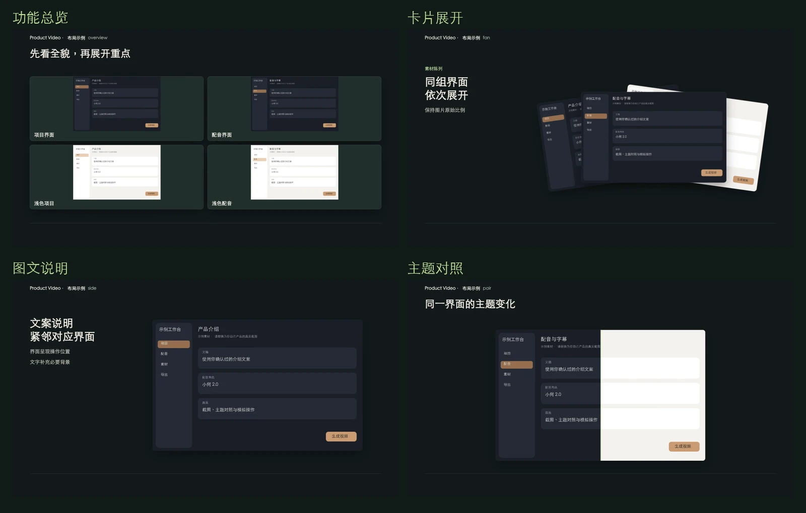
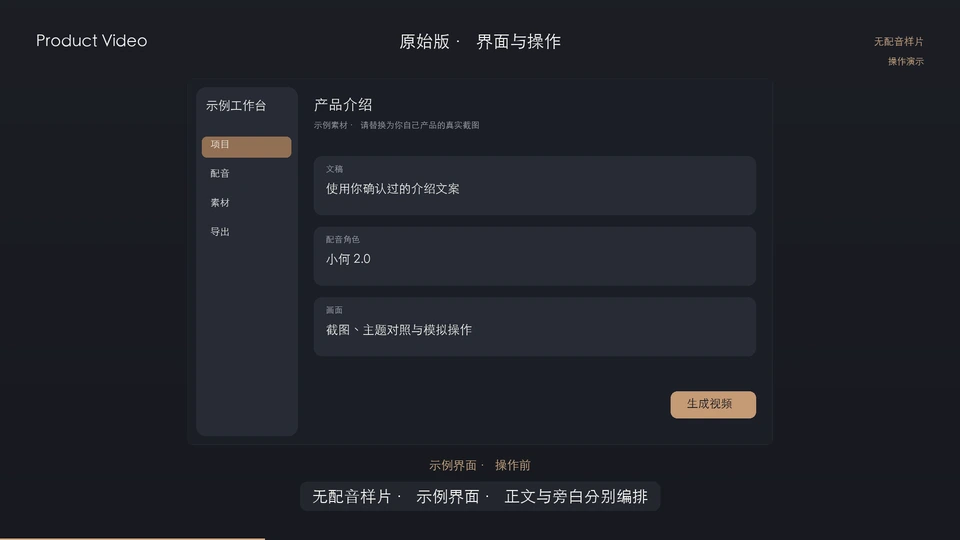
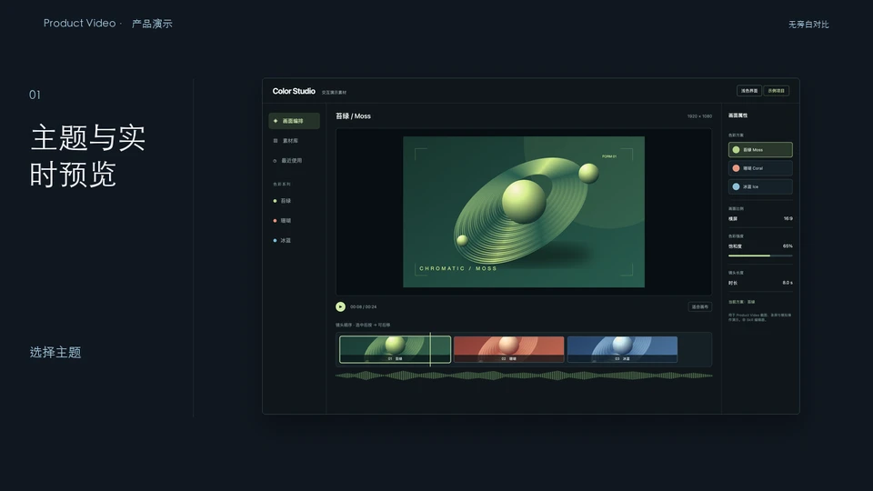
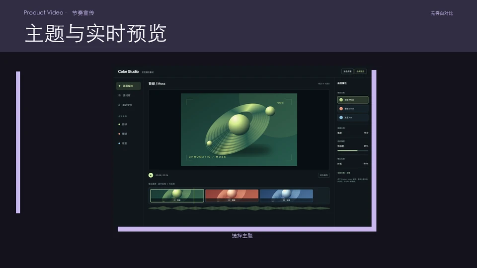
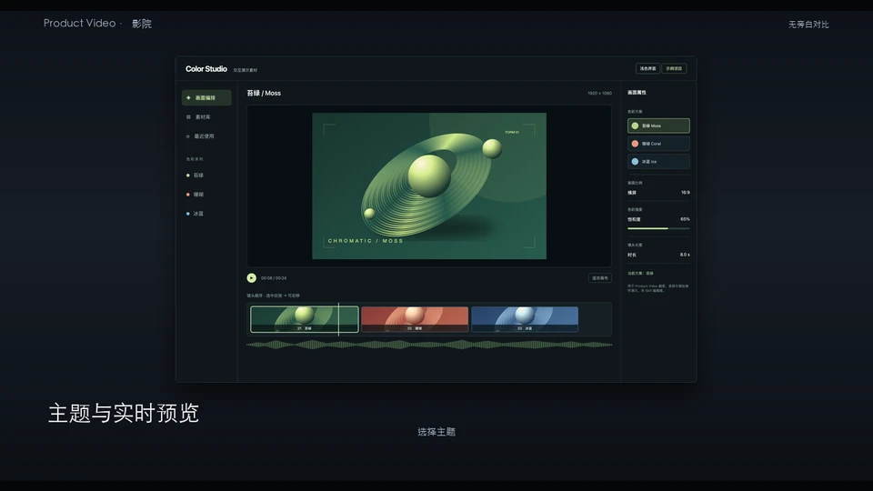
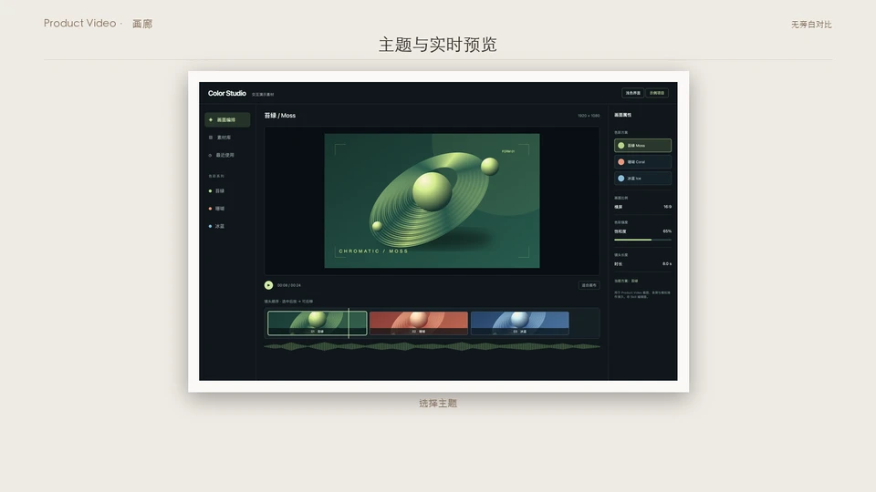

<div align="center">


# Product Video

**理解产品，组织内容，把真实界面做成带旁白的视频。**

功能总览与详细演示 · 内容排版 · 完整镜头库 · 配音与字幕 · 可编辑时间轴

[开始使用](#开始使用) · [本次更新](#21-更新) · [效果与示例](#效果与示例) · [配置文档](#配置与命令)

</div>

Product Video 是面向 Codex 等 Agent 的产品视频制作 Skill。提供项目、网址或应用和介绍要求，Agent 核对实际功能、采集所需界面、整理文稿、编排镜头，再生成配音、字幕和 MP4。你可以制作产品宣传、操作演示、功能讲解或版本更新报告，也可以继续修改已有视频。

```text
使用 $product-video，给这个项目做一支带中文旁白的宣传视频。
先认真检查项目和最新界面，开头介绍主要功能，再按使用流程详细展开。
按内容排版，多使用不同用途的镜头，三维只在需要时出现。
文案简洁、专业，不用反问、套话或空泛收尾，最后交付视频文件。
```

## 2.1 更新

这次把实际制作中需要反复调整的内容组织、版式和运动做成了可复用能力。功能数量、标题、素材、聚焦时机和切片边界都来自当前项目。

| 更新 | 具体变化 |
| --- | --- |
| **先总览，再展开** | 完整介绍先建立功能关系，再展示入口、操作和结果；短预告、单项教程与已确认结构按各自需求编排 |
| **六种内容版式** | 功能总览、总览进入细节、卡片展开、宽幅界面、图文并排、双图对照，直接绑定产品图片与说明 |
| **更多有用途的运动** | 按实际分栏或内容行展开、焦点回归、倾斜回正、遮罩、面板展开、连续浏览、翻面与主题对照 |
| **旁白决定展示节奏** | 镜头沿用实际音频时长；总览可按讲解时间逐项聚焦，长镜头后半段继续运动 |
| **检查导出的文件** | 新增 `review`，直接从已验证 MP4 提取复核帧；支持长视频的大量采样点 |
| **修复长视频校验** | FFmpeg 超时参数取整，避免渲染完成后因小数参数导致校验失败 |

[内容组织方法](references/storytelling.md) · [内容镜头配置](references/editorial.md) · [2.1 验证记录](docs/validation-2.1.md)

### 从初版到现在

| 初版基础 | 当前能力 |
| --- | --- |
| 章节文稿、截图与配音 | 增加产品理解、功能总览、内容排版和按工作流程展开的分镜规则 |
| 原始二维布局 | **`classic` 继续保留**，另有六种构图与入场方式不同的二维风格 |
| 截图切换与指针演示 | 增加移动、停留、按下、结果与驻留的因果时序，以及实际控件坐标绑定 |
| 静态界面素材 | 增加网页自动采集、真实操作录屏和按需采集 macOS 窗口 |
| 二维合成 | 增加 Three.js 设备场景、灯光材质、镜头路径和屏幕视频纹理 |
| 原有视频管线 | 将完整 video-shotcraft 源库、Remotion 工作台、配音和字幕整合到同一项目 |
| 成片导出 | 增加可编辑工程、多轨音频、素材哈希、完整解码和成片逐帧复核入口 |

旧项目 `schema_version: 1` 默认使用原合成器；新项目 `schema_version: 2` 默认使用 Remotion。已有 `classic` 项目、声音选择、文案和操作配置可继续使用。

## 开始使用

### 安装 Skill

需要 **Python 3.11+、Node.js 22+、npm、FFmpeg、ffprobe** 和中文字体。macOS 使用系统字体；其他环境可在项目中指定字体文件。macOS 窗口采集需要系统权限，网页采集使用 Playwright。Windows 运行环境尚未验证。

首次安装到 Codex：

```sh
git clone https://github.com/Lincb522/product-video.git ~/.codex/skills/product-video
sh ~/.codex/skills/product-video/scripts/setup.sh
```

setup 在 Skill 目录安装 Python 虚拟环境、Node 依赖和浏览器运行环境；FFmpeg 需事先安装。若目录已存在，先保留自定义改动，再更新完整 Skill 目录。通过 Git 安装且没有本地改动时可运行：

```sh
git -C ~/.codex/skills/product-video pull --ff-only
sh ~/.codex/skills/product-video/scripts/setup.sh
```

也可下载 [Releases](https://github.com/Lincb522/product-video/releases) 中的完整安装包。源码、镜头素材和许可证需要一起安装，不能只复制 `SKILL.md`。

### 生成视频

在 Codex 中使用 `$product-video` 并描述项目和要求。Skill 负责整理配置与采集计划，不要求你手写 JSON。第一次生成旁白时会打开本机设置页，引导配置火山引擎 TTS；已有音色和配置会继续使用。

常用请求：

- **产品宣传**：「先介绍主要功能，再详细展示常用流程，带中文旁白，交付 1080p MP4。」
- **版本报告**：「从初版到当前版本梳理新增、优化与修复，在对应画面说明技术栈和实现方式。」
- **操作教程**：「展示创建项目到导出的完整流程，界面文字要能看清，每步保留操作结果。」
- **修改已有视频**：「保留素材和声音，调整前半段结构，增加对照镜头，减少重复三维展示。」

文案与旁白统一遵循 [写作规范](references/narration.md) 和 [No AI Slop 适配复核](references/narration-review.md)：使用简洁、专业的陈述句，删除反问、重复解释、夸张措辞和无依据的收尾。正文补充界面信息，字幕跟随旁白。

## 效果与示例

### 内容镜头



[播放内容镜头示例](docs/assets/editorial-demo.mp4)。这是使用演示界面和静音音轨生成的布局样片，用于检查版式与运动；正式产品视频使用目标产品的真实素材和配音。

| 版式 | 适合内容 |
| --- | --- |
| `overview` | 2–6 项主要功能，先看全貌，再逐项放大 |
| `portal` | 从总览进入具体功能 |
| `fan` | 同组页面或结果的卡片陈列 |
| `full` | 大幅界面与上方标题，适合阅读细节 |
| `side` | 界面与必要说明并排 |
| `pair` | 两种状态、主题或版本的对应比较 |

这些版式可以与截图操作、三维场景和原始 Shotcraft 镜头交替使用。不是每个镜头都需要截图，但功能演示应有相应界面或结果，避免连续文字页。

### 完整 Shotcraft 镜头库

[video-shotcraft](https://github.com/Vincentwei1021/video-shotcraft) 的完整源库已经植入：**157 张镜头卡、214 个画廊样式全部映射，运行目录共 218 个镜头组件**。覆盖开场、界面入场、交互、运镜、转场、文字、数据、节奏与收尾。目录另含 149 条音效和 5 条 BGM。

原组件的文案、逐字动画、颜色、字体和媒体可通过内容映射替换。依赖特定界面几何的镜头仍需按实际页面调整；不能把上游示例画面直接当成目标产品。新增内容镜头使用自己的产品版式，不改变上游目录数量。

```sh
SKILL="$HOME/.codex/skills/product-video"
RUN="$SKILL/scripts/engine/run.sh"
"$RUN" motions --search 转场
"$RUN" motions --search 卡片
"$RUN" motions --kind sfx
```

[镜头、内容绑定与多轨语音](references/shotcraft.md)

### 七种二维风格

原生二维镜头有各自的构图、文字层级、截图陈列和入场方式。`video.style` 控制这些原生镜头；选定的 Shotcraft 组件与 `editorial` 内容版式使用自身构图。

| 原始 `classic` | 产品 `product` | 宣传 `promo` | 教程 `tutorial` |
| --- | --- | --- | --- |
|  |  |  |  |

| 影院 `cinema` | 画廊 `gallery` | 极简 `minimal` |
| --- | --- | --- |
|  |  |  |

[二维构图与操作规则](references/motion.md) · [六款风格差异验证](docs/validation-2.0.1.md)

### 三维与真实操作

[](docs/assets/studio-demo.mp4)

Three.js 场景支持设备组合、材质、灯光、环境反射、地面投影和镜头路径，屏幕可以放入实际截图或录屏。包含具体设备模型及通用手机、平板、笔记本和屏幕面板。介绍对象可以是网页、桌面软件或移动应用；设备只是展示选项。

截图模拟操作遵循「移动 → 停留 → 按下或释放 → 展示真实结果 → 驻留」。连续输入、滚动或拖动中的内容变化使用真实录屏。采集和结果需按实际来源标注。

[三维场景与录屏](references/three-dimensional.md) · [真实界面采集](references/capture.md)

## 配置与命令

日常通过 Skill 完成制作；需要检查、继续渲染或编辑工程时使用 CLI：

| 命令 | 作用 | 语音 API |
| --- | --- | --- |
| `check PROJECT` | 检查配置、素材和布局约束 | 不调用 |
| `capture PROJECT` | 执行采集计划，生成素材与解析配置 | 不调用 |
| `voice PROJECT` | 分章生成旁白 | 缺缓存时调用 |
| `prepare-motion PROJECT` | 用已有旁白准备可编辑时间轴 | 默认不调用 |
| `studio PROJECT` | 打开镜头库、预览与多轨工作台 | 主动生成旁白时调用 |
| `preview PROJECT` | 用已有配音生成关键帧 | 不调用 |
| `render PROJECT` | 用已有配音渲染并完整解码验证 | 不调用 |
| `review PROJECT` | 从已验证 MP4 提取关键帧 | 不调用 |
| `auto PROJECT` | 采集、首次配置、配音、字幕、成片 | 缺缓存时调用 |

当前主合成器支持 **16:9、24–60 fps**，默认 **1920×1080 / 30 fps**；不是任意画幅导出器。中文、英文自动字幕使用 API 时间戳；其他语言需提供对齐字幕或明确关闭字幕。音色目录快照含 547 个不同 ID，具体可用性取决于当前账号授权。

工作台可编辑镜头顺序、时长、文案、旁白、字幕和音频轨。新增内容镜头的图片列表、布局、聚焦时机与切片边界在项目 JSON 中设置，当前属性面板尚未覆盖全部嵌套字段。

[完整命令与语音配置](scripts/engine/README.md) · [内容镜头字段](references/editorial.md) · [正文版式](references/content.md) · [Skill 工作流](SKILL.md)

## 交付文件

`output/latest.json` 指向通过校验的最新成片。对应渲染目录包含：

```text
product-introduction.mp4    H.264 + AAC 视频
subtitles.srt              外挂字幕
narration.txt              实际旁白稿
project.resolved.json      解析后的配置
timeline.json              配音和章节时间轴
verification.json          规格、时长、素材哈希与完整解码结果
studio/project.json        Remotion 可编辑工程
studio/public/             对应图片、字体与分章音频
preview/                   渲染前的关键帧
review/                    从实际 MP4 提取的复核帧
```

`preview/` 和 `review/` 由对应命令生成。原引擎另输出合并旁白 `narration.wav`。相同文稿与音色参数复用已验证音频；改图片、排版或转场无需重新合成语音。旧成片保留，视觉、操作因果和听感需结合实际播放检查。

## 实现与开发

| 技术 | 职责 |
| --- | --- |
| Python + Pillow | 配置检查、素材处理、原生二维构图、字幕和项目编排 |
| Playwright / macOS 窗口采集 | 获取实际页面、控件位置与操作录屏 |
| React + TypeScript + Remotion | 内容镜头、Shotcraft 组件、多轨时间轴与最终合成 |
| Three.js | 三维设备、材质灯光、镜头与屏幕纹理 |
| 火山引擎 TTS | 角色配音与字级时间戳；沿用既有语音管线 |
| FFmpeg + ffprobe | 音视频处理、H.264/AAC 编码、完整解码与成片抽帧 |

镜头和字幕按实际音频边界换算到共享帧时钟。旧版截图操作与三维画面先生成片段，再和新镜头一起进入 Remotion 时间轴。镜头内容映射在组件作用域内生效，原库的示例文字与图片不会自动变成产品事实。

```sh
cd scripts/engine
PYTHONPATH=. .venv/bin/python -m unittest discover -s tests -v

cd ../../vendor/video-shotcraft/workbench
npm run build
npm run test:integration
```

离线示例与打包：

```sh
# 在 scripts/engine 下：使用标明来源的演示图片和静音，不调用 TTS
.venv/bin/python examples/render_editorial_demo.py ~/Movies/editorial-demo --mode preview
./run.sh render ~/Movies/editorial-demo/project.json
./run.sh review ~/Movies/editorial-demo/project.json

# 在仓库根目录，安装包写到仓库外
python3 scripts/package.py ../product-video-2.1.0.zip
```

[2.0 整合验证](docs/validation-2.0.md) · [2.1 验证记录](docs/validation-2.1.md)

## 许可与来源

Product Video 自有代码采用 [MIT](LICENSE)。Shotcraft 快照固定在 `5e71af3`，保留 [Apache-2.0 许可证](vendor/video-shotcraft/LICENSE)、来源与修改说明。Three.js、No AI Slop、Remotion、音频素材及其他依赖遵守各自许可；本项目的 MIT 不替代这些条款。完整来源见 [NOTICE](NOTICE)，适配修改见 [MODIFICATIONS](vendor/video-shotcraft/MODIFICATIONS.md)。
